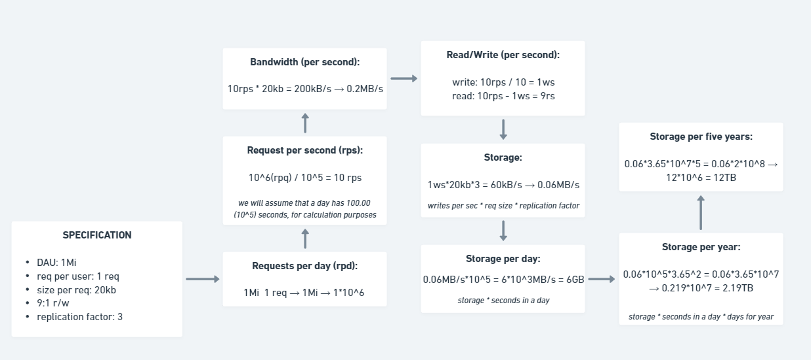

## MBA Full Cycle - System design and Design Docs

### System Design

- Definition: is the process of defining the architecture, modules, interfaces, and data for a system to satisfy specified requirements.
- Importance:
  - it's the process of intentionally thinking about architecture;
  - it's the process of thinking about the definitions that really matter;
  - it's the process of exploring possible solutions;
  - it's the process of thinking about the present and the future of the software;
  - exercise the way of thinking about different software solutions;
- Techniques and methodologies:
  - understand the problem and requirements;
  - estimate the capacity:
    - throughput, latency, storage, etc;
  - data modeling:
    - helps to define the database;
  - API design:
    - helps to define the main functionalities;
  - system design:
    - helps to define the architecture;
  - exploration:
    - helps to define the best solution from the confrontation on the justification of the choices;
- Requirements:
  - core features:
    - the domain of the application and the main functionalities;
  - support features:
    - the features that support the core features;
  - functional requirements:
    - what the system should do (features and functionalities);
  - non-functional requirements:
    - how the system should do (components, architecture, etc);
  - constraints:
    - what the system can't do;

## Practical example

- Problem: a system to send tickets to events;
- Functional Requirements:

  - Core functionalities:
    - buy a ticket;
    - show the ticket to get access to the event;
    - partners to manage the events;
  - Support functionalities:
    - payment (split payment);
    - search events;
    - graphical exibition of available seats/places;
    - guarantee that a ticket is not sold to more than one person;

- Non-Functional Requirements:

  - characteristics (CAP theorem):
    - low latency;
    - high availability;
    - scalable;
    - data consistency;
  - important data (we need of data or estimates to make the system design):
    - DAU (daily active users) - one million;
    - each user will do 5 requests;
    - each request will result in 50KB of data;
    - 5% of the users buy ticket (convertion rate);
    - read/write ratio: 90/10;
    - may have peak hits;
  - calcs:
    - 1M (DAU) * 5(requests) = 5M (5*10^6) requests per day;
    - we will assume that a day has 100.00 (10^5) seconds, for calculation purposes;
    - 5*10^6 / 10^5 = 5*10^(6-5) = 5\*10^1 = 50 requests per second (rps);
    - shopping per day -> 5% of 1M = 5*10^4 shoppings per day;
    - shopping per seconds -> 5*10^4 / 10^5 = 0.5 shoppings per second;
    - bandwidth = 50rps * 50kb = 2.500Kb/s = 2.5Mb/s;

- CAP theorem:

  - Consistency: all nodes see the same data at the same time;
  - Availability: every request receives a response, without the guarantee that it contains the most recent write;
  - Partition tolerance: the system continues to operate despite an arbitrary number of messages being dropped;
  - Theorem: it's not possible to have all three guarantees at the same time;
  - Solution: choose two of the three guarantees;

- Eventual consistency:

  - it's a consistency model that allows the system, eventually, have duplicate data, for a period of time, but, when the central system realizes the duplicity, it takes action;

- Capacity plan (Exercise):

  
- System Design - practice:

  - SPOF (Single Point of Failure):
    - is a component of a system that, if it fails, will stop the entire system;
    - example:
      - a single database;
      - a single server;
      - a single load balancer;
    - a SPOF can be avoided with a composition pattern;

  - Composition Pattern:
    - is to compose a set of resources to meet some demand within the design/software;
    - example:
      - load balancer and replications;
    - a composition pattern avoids SPOF (Single Point of Failure) in the following way:
      - using the config called "n + x", where "n" is the number of resources needed to meet the demand and "x" is the number of additional resources, usually one for maintenance and one for updating;
      - example:
        - if we have 3 servers in a cluster, and one is under maintenance and the other is being updated, it is necessary for the other server to support the full workload, even with a degraded response time;

  - Disaster Recovery (DR):
    - it is a critical scenario where it is necessary to have a system resilient to failures;
    - the more critical, the less dehydrated, that is, what is the minimum pre-provisioning condition to withstand the workload; 
    - example:
      - a backup of the database;
      - a backup of the code;
      - a backup of the infrastructure;
      - multizonal and multi-regional services; 
    - a DR can be avoided with a composition pattern;
  
  - RPO (Recovery Point Object):
    - is a control method for calculating the threshold amount of data an organization would tolerate losing in the event of a crash or outage;
  
  - RTO (Recovery Time Objective):
    - maximum period of time that the system will take to return to operation after a stop or breakdown;

  - About RPO and RTO: 
    - RPO and RTO define the "x" of the "n + x" composition pattern;
    - the smaller RPO and define, the greater the investment;